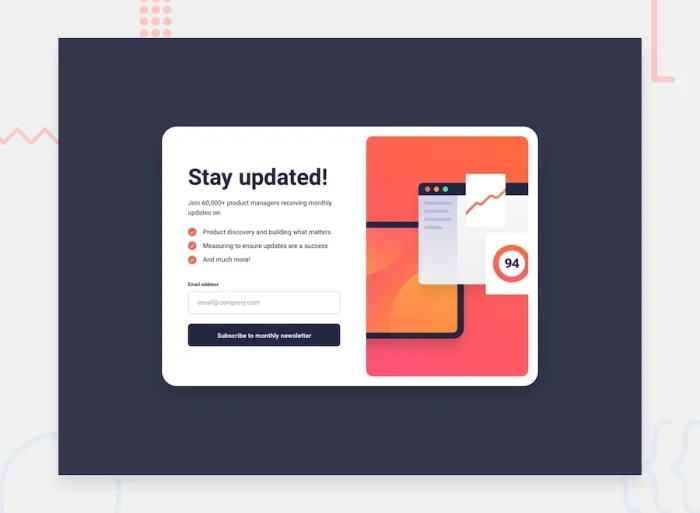

# Frontend Mentor - Newsletter Sign-up Form

This is a solution to the Newsletter Sign-up Form frontend mentor challenge. It features an email subscription form with success and error messages.

## Table of Contents

- [Frontend Mentor - Newsletter Sign-up Form](#frontend-mentor---newsletter-sign-up-form)
	- [Table of Contents](#table-of-contents)
	- [Overview](#overview)
		- [Screenshot](#screenshot)
		- [Links](#links)
		- [Built With](#built-with)
		- [Key Features](#key-features)
	- [How to Use](#how-to-use)
	- [Contributing](#contributing)
	- [License](#license)
	- [Author](#author)

## Overview

This project is a responsive newsletter sign-up form that validates email addresses and displays success or error messages based on the input. It is built using HTML, CSS, and JavaScript, and follows best practices for accessibility and responsiveness.

### Screenshot



### Links

- [Solution URL](https://www.frontendmentor.io/solutions/newsletter-sign-up-form-1qvnwthaag)
- [Live Site URL](https://dz-newsletter-signup-form.netlify.app/)

### Built With

- Html5
- CSS3
- JavaScript

### Key Features

- Responsive design that works on both mobile and desktop devices.
- Email validation to ensure users enter a valid email address.
- Success message displayed upon successful subscription.
- Error message displayed for invalid email addresses.
- Smooth animations for showing and hiding elements.
- Accessible form with proper ARIA attributes and live regions.

## How to Use

1. **Clone the repository**:

   First, clone this repository to your local machine. Open your terminal and run the following command:

   ```bash
   git clone https://github.com/hichamweblog/FEM-Newsletter-Signup-Form.git
   ```

2. **Navigate to the Project Folder**:

   Change your working directory to the newly cloned project folder:

   ```bash
   cd FEM-Newsletter-Signup-Form
   ```

3. **Install Dependencies**:

   Install the required packages by running:

   ```bash
   pnpm install
   ```

4. **Run the project**:

   ```bash
   pnpm run dev
   ```

   This command will launch a development server, and you'll be able to view the website locally in your web browser.

## Contributing

If you would like to contribute to this repository, feel free to open issues or submit pull requests. Contributions and improvements are always welcome.

## License

This project is licensed under the [MIT License](./LICENSE).

## Author

- Frontend Mentor - [@hichamweblog](https://www.frontendmentor.io/profile/hichamweblog)
- LinkedIn - [@hichamweblog](https://linkedin.com/in/hichamweblog)
- X - [@hichamweblog](https://x.com/hichamweblog)
